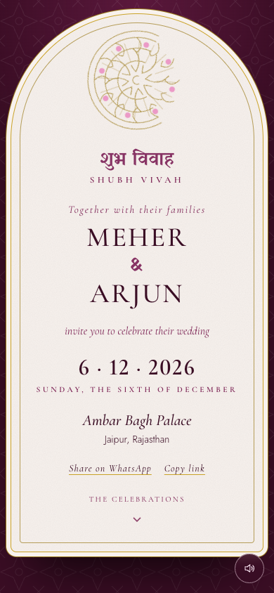

# Wedding invitation

An animated wedding invitation in a single self-contained HTML file. Open it and a sealed
envelope waits; tap the seal and the card it holds becomes the invitation.



Meher and Arjun are fictional, and so is the venue. This is a study piece: a real invitation
would swap the names, dates, events and venue in `index.html` and change nothing else.

## Running it

There is no build step and no dependencies. Open `index.html` in a browser, or serve the
folder if you want the share links to resolve properly:

```bash
python3 -m http.server 8080
```

Then visit `http://127.0.0.1:8080/`.

## Three independent axes

A guest only ever sees one look — the one set in `LOOK` near the top of the script. Append
`?review=1` to the URL to expose three pickers and try the rest:

| Axis | Options |
|---|---|
| **Design** | `letterpress` · `royal` · `film` · `minimal` · `kinetic` |
| **Theme** | `emerald` · `demon` · `amber` · `orchard` · `coastal` · `plum` · `slate` |
| **Event layout** | `list` (tap to open) · `cards` (swipeable tiles) · `stack` (editorial) |

Any combination can also be linked directly, which is useful for sharing a specific look
with someone:

```
index.html?review=1&design=royal&theme=plum&layout=list
```

None of these parameters survive into the WhatsApp share link a guest receives.

## What is in here

- **A reveal per design.** The royal one draws a mandala and parts a pair of doors; the
  letterpress one cracks a wax seal. In every case the card that rises out of the envelope
  becomes the invitation itself, measured and animated into place rather than cross-faded.
- **A schedule that follows you.** Scrolling the three-day timeline opens whichever event is
  nearest the reading line and closes the rest, with a dead zone and scroll compensation so it
  never fights you, and a short pin after a tap so a deliberate choice wins.
- **A score, not a track.** Continuous bansuri and shehnai trading phrases, plus the reveal
  cues, are synthesized in the Web Audio API — see below.
- **Original artwork.** The marigolds, garland, wax seal, mandala and event icons are drawn
  in inline SVG. No image assets ship with the page.

## The audio

There is no audio file. Every note is generated in the browser: a bansuri built from a sine
body with breath noise and delayed vibrato, and a shehnai built the opposite way round — a
detuned sawtooth pair through two narrow bandpass formants, which is what gives a double reed
its cry. They trade phrases over a generated convolution reverb.

The melody is drawn from **Bhupali**, the major pentatonic. That is a practical choice as much
as a cultural one: over a fixed tonic every degree of the scale is consonant, so the line can
wander indefinitely without ever landing on a clash — which is what an endlessly looping
background needs.

Nothing autoplays. The audio context is not even created until you tap to open, there is a
mute control from the first screen, your choice is remembered, and a hidden tab suspends
playback.

## Accessibility

Text sits on a 12px floor at weight 400 or above, and every foreground/background pair was
measured against its composited background rather than eyeballed — the lowest ratio in the
default look is 6.9:1, comfortably past WCAG AA. All controls have at least 44px of hit area
and a visible focus ring. Headings are ordered, landmarks are marked, the Devanagari is tagged
`lang="hi"`, decorative SVG is hidden from screen readers, and `prefers-reduced-motion` is
honoured throughout.

## Browser support

Modern evergreen browsers. It leans on `color-mix()`, `:has()`, CSS grid row animation and the
Web Audio API.

## Licence

The code and artwork here are original. The three type families load from Google Fonts and are
licensed under the SIL Open Font License. No licence has been chosen for this repository yet —
add one before sharing it onward.
